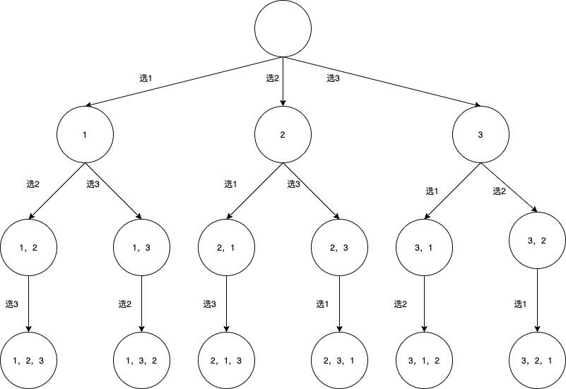
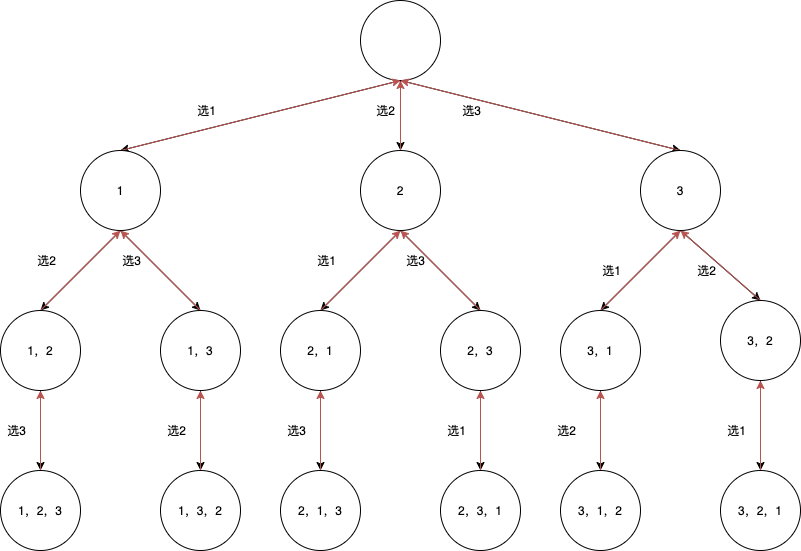

# 回溯搜索

[全排列](https://leetcode-cn.com/problems/permutations/)

## 题目

给定一个*没有重复*数字的序列，返回其所有可能的全排列。

## 思路

回忆一下高中学过的排列组合数学题。n 个不重复的数，全排列共有 n! 个。

1 2 3 的全排列穷举：

一般不会无规律的胡乱穷举，而是先固定高位后穷举。

- 高位固定 1

  - 高位固定 2
    1，2，3

  - 高位固定 3
    1，3，2

- 高位固定 2

  - 高位固定 1
    2，1，3

  - 高位固定 3
    2，3，1

- 高位固定 3

  - 高位固定 1
    3，1，2

  - 高位固定 2
    3，2，1

全排列个数 3 \* 2 \* 1 = 6

以上过程其实就是一种回溯算法，我们无师自通。实际上以上过程还可以使用一颗决策树来表示。

决策过程：（选择/决定）



回溯过程：（反悔）



```伪代码
function backtrack(路径, 选择列表) {
    // 结束条件
    if(选择列表.size() == 0) {
        找到一条路径
        return;
    }
    for 选择 in 选择列表：
    // 做选择
    路径.add(选择)
    选择列表.remove(选择)

    backtrack(路径, 选择列表)

    // 撤销选择
    选择列表.add(选择)
    路径.remove(选择)
}
```

按照模板来写：

```C++
class Solution {
public:
   void backtrack(vector<int> path, vector<int> selectedList, vector<vector<int>> &ans)
   {
       if (selectedList.size() == 0)
       {
           ans.push_back(path);
           return;
       }
       for (vector<int>::iterator it = selectedList.begin(); it != selectedList.end();it++)
       {
           int selected = *it;
           path.push_back(selected);
           selectedList.erase(it);

           backtrack(path, selectedList, ans);
           selectedList.insert(it, selected);
           path.pop_back();
       }
   }

   vector<vector<int>> permute(vector<int> &nums)
   {
       vector<vector<int>> ans;
       vector<int> path;
       backtrack(path, nums, ans);
       return ans;
   }
};

```

selectedList.insert(it, selected); 这句插入会比较耗时。

空间换时间，引入标记数组，加入层级概念，修改终止条件。

```C++
class Solution {
public:
   void backtrack(int len, int depth, vector<int> path, vector<int> selectedList, vector<int> used, vector<vector<int>> &ans)
   {
       if (depth == len)
       {
           ans.push_back(path);
           return;
       }
       for (int i = 0; i < selectedList.size(); i++)
       {
           if (used[i] == 0)
           {
               int selected = selectedList[i];
               path.push_back(selected);
               used[i] = 1;

               backtrack(len, depth + 1, path, selectedList, used, ans);

               used[i] = 0;
               path.pop_back();
           }
       }
   }

   vector<vector<int>> permute(vector<int> &nums)
   {
       vector<vector<int>> ans;
       vector<int> path;
       vector<int> used;
       for (int i = 0; i < nums.size(); i++)
       {
           used.push_back(0);
       }
       backtrack(nums.size(), 0, path, nums, used, ans);
       return ans;
   }
};
```

> 回溯法（back tracking）（探索与回溯法）是一种选优搜索法，又称为试探法，按选优条件向前搜索，以达到目标。但当探索到某一步时，发现原先选择并不优或达不到目标，就退回一步重新选择，这种走不通就退回再走的技术为回溯法，而满足回溯条件的某个状态的点称为“回溯点”。

基本思想：在包含问题的所有解的解空间树（决策树）中，按照深度优先搜索的策略，从根结点出发深度探索解空间树。当探索到某一结点时，要先判断该结点是否包含问题的解，如果包含，就从该结点出发继续探索下去，如果该结点不包含问题的解，则逐层向其祖先结点回溯。

## 复杂度

- 时间复杂度 O(n x n!)

  回溯算法时间复杂度一般都较高，因为避免不了穷举整棵决策树。

  算法的复杂度首先受 backtrack 的调用次数制约，backtrack 的调用次数是 O(n!)。

  backtrack 中找到一条路径后，需要拷贝路径到结果集中，时间复杂度为 O(n)。

  综上，总的时间复杂度为 O(n x n!)。

- 空间复杂度 O(n x n!)

  - 递归树深度 n
  - 标记数组 n
  - 结果集是一个二维空间，全排列个数 n!，每个全排列占空间 n。

## 优化

如何在不影响时间复杂度的情况下，优化掉标记数据。
将待排列数据分成左右两块，左边是已排列的，右边是未排列的，通过交换的方式可以取巧地实现。缺点是全排列的最终结果不是按字典序输出的。

```C++
class Solution {

public:
    vector<vector<int>> ans;

    void dfs(int n, vector<int> nums, int depth) {
        if(depth == n) {
            ans.push_back(vector<int>(nums));
            return;
        }
        for(int i = depth; i < n; i++) {
            swap(nums[depth], nums[i]);
            dfs(n, nums, depth+1);
            swap(nums[i], nums[depth]);
        }
    }

    vector<vector<int>> permute(vector<int>& nums) {
        if(nums.empty())
            return {};
        int n = nums.size();
        dfs(n, nums, 0);
        return ans;
    }

};
```

## 总结

回溯法本质是对隐式树的深度优先搜索算法。

回溯（回溯搜索） = 深度优先遍历（DFS） + 状态重置 + 剪枝（提前知道这一条分支不能搜索到满意的结果，就可以提前结束，这一步操作称之为剪枝）

全排列是经典的回溯搜索。在选择当前排列数字时有两种决策，一个是选择当前数字（选择当前数字后，该数字不能再被选，继续选择），一个是选择下一个数字。

---

相关问题：

- [全排列 2](https://leetcode-cn.com/problems/permutations-ii/)
- [N 皇后](https://leetcode-cn.com/problems/n-queens/)
- [N 皇后 2](https://leetcode-cn.com/problems/n-queens-ii/)
