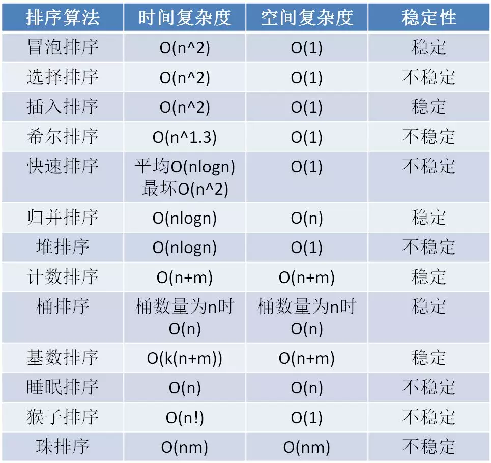

# 排序

时间复杂度是算法时间耗费的抽象表示，空间复杂度是算法空间耗费的抽象表示。
稳定性是指集合包含多个相同值时，排序后它们的相对顺序不变。

## 时间复杂度O(n^2)的排序

### 冒泡排序

相邻位置根据大小两两交换，大的最终会被“冒泡”到左侧。冒泡过程 O(n), (n -1) 轮。

优化：

1. 在某一轮冒泡过程中没有进行过交换，说明左侧未排序部分已经有序，可以提前结束排序，节省后面的比较轮次。
2. 在某一轮冒泡过程中有进行交换，但是未排序部分在交换位置的右侧有部分有序部分，实际上不需要再冒泡，需记录最后一次交换的位置作为有序无序的边界，那么后面的部分就是有序的，下一轮只需要冒泡到边界即可。
3. 在某一轮冒泡过程中有进行交换，但是未排序部分在交换位置的左侧有部分有序部分，实际上这部分不需要冒泡。冒泡排序默认是单向的，这里可以改变一下思路，用类似钟摆的方式，进行左->右->左的方式进行双向排序，仿照单向排序情景1和情景2的优化方式，分别记录下已全部有序标识、有序无序左边界，有序无序右边界。

注：情景3又被称为鸡尾酒排序（或快乐小时排序）。

### 选择排序

未排序部分选最小，放到排序部分尾部。选最小 O(n)，（n-1）轮。

注：选择排序虽然有比冒泡排序交换次数少的优势，但它是不稳定排序。

### 插入排序

打扑克理牌过程，将未排序元素一个个插入到已排序部分合适的位置（刚好左边比它小右边比它大）。插入过程 O(n), (n-1) 轮。

### 三种时间复杂度O(n^2)排序比较

- 冒泡排序和插入排序的元素比较交换次数取决于原始数组的有序程度。
- 选择排序的元素比较交换次数是固定的，和原始数组的有序程度无关。
- 插入排序的性能略高于冒泡排序。冒泡排序每两个元素之间的交换是彼此独立的，插入排序的元素交换是连续。

*当原始数组接近有序时，插入排序性能最优；当原始数组大部分元素无序时，选择排序性能最优。*

## 时间复杂度O(n) ~ O(n^2)之间的排序

### 希尔排序

希尔排序建立在插入排序的基础上。

- 在大多数元素已经有序的情况下，插入排序的工作量较小。
- 在元素数量较少的情况下，插入排序的工作量较小。

逐步分组进行粗调，再进行直接插入排序。分组跨度被称为希尔排序的增量，朴素方法希尔增量是指逐步折半的增量方法。平均时间复杂度 O(n^1.3)，最坏时间复杂度还是 O(n^2)。

### 快速排序

分治法思想的体现：

- 每轮挑选一个基准元素。
- 把其他比它大的元素移动到一边，比它小的元素移动到另一边。

平均复杂度 O(n^logn)，平均情况下需要logn轮，每轮移动元素 O(n)。
选择基准元素有可能选到最大最小，所以最坏时间复杂度是 O(n^2)。

### 归并排序

- 每轮折半分组。
- 将两个有序小集合，归并成一个大集合。

时间复杂度 O(n^logn)，需要logn轮，每轮归并操作 O(n)。

### 堆排序

- 把无序数组构建成二叉堆。
- 循环删除堆顶元素，移到集合尾部，调节堆产生新的堆顶。

二叉堆的节点下沉调整（downAdjust 方法）是堆排序算法的基础，该操作时间复杂度 O(logn)。
第一步构建二叉堆需要进行n/2次循环，每次需要调用节点下沉调整（downAdjust 方法），n/2 * logn，时间复杂度 O（nlogn）。
第二步，需要进行n-1次循环，每次需要调用节点下沉调整（downAdjust 方法），（n-1） * logn，时间复杂度 O（nlogn）。
两步是并列关系，所以整体的时间复杂度同样是 O（nlogn）。

### 时间复杂度O(n) ~ O(n^2)之间的排序比较

- 虽然快速排序的平均时间复杂度是O（nlogn），但是在极端情况下，最坏时间复杂度是O（n^2）；而归并排序和堆排序的时间复杂度稳定在O（nlogn）。
- 二叉堆的父子节点在内存中并不连续，因此堆排序的平均性能比快速排序和归并排序略低。
- 归并排序是稳定排序，快速排序和堆排序是不稳定排序。
- 快速排序和堆排序是原地排序，不需要开辟额外空间。而归并排序是非原地排序。

## 时间复杂度O(n)的排序

### 计数排序

适用于一定范围的整数排序。

时间复杂度 O(n+m)。m是整数范围。

### 桶排序

- 求数列最大最小值
- 创建空桶
- 遍历原始数列
- 在每个桶内部做排序

第一步求数列最大最小值，运算量为n。

第二步创建空桶，运算量为m。

第三步遍历原始数列，运算量为n。

第四步在每个桶内部做排序，由于使用了O（nlogn）的排序算法，所以运算量为 n/m \* log(n/m ) \* m。

第五步输出排序数列，运算量为n。

加起来，总的运算量为 3n+m+ n/m \* log(n/m ) \* m = 3n+m+n(logn-logm) 。

去掉系数，时间复杂度为：

O(n+m+n(logn-logm)

### 基数排序

建立在计数排序基础上，解决整数限制（将字符串按位划分多次计数排序），并要求使用的计数排序是稳定的。

计数排序时间复杂度 O(n+m)，进行k次。m是字符范围，k是最长字符串长度。

## 排序总结表格

---

参考资料：

- [程序员小灰的排序算法总结](https://mp.weixin.qq.com/s/teOGQlslb6aP4AQrx7TTzA)
